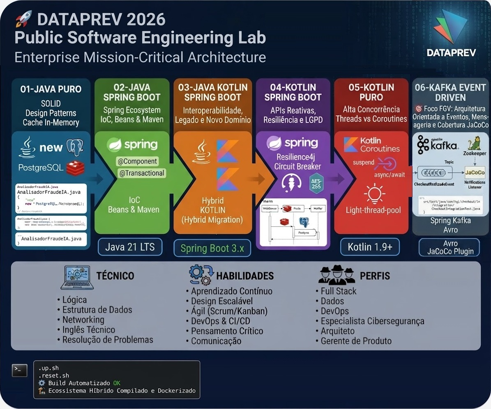
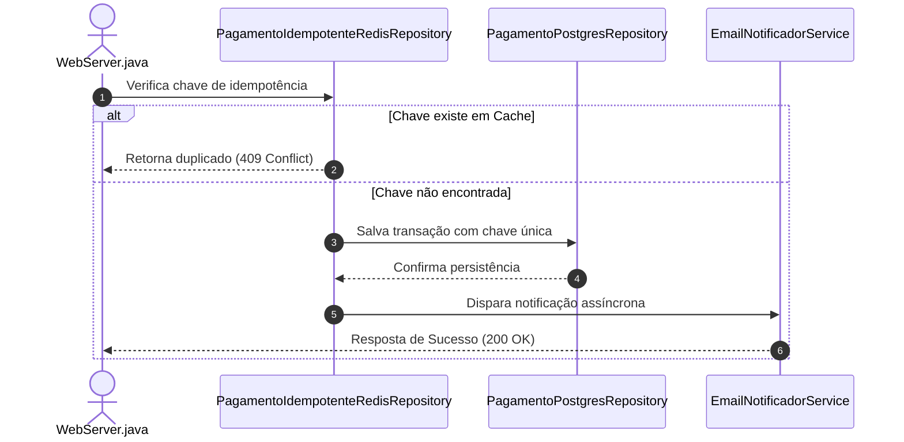

<!--
Label: 🚀 Programa de treinamento DATAPREV 2026: Implantação e Governança de Software Público
Description: 🏛️ Programa de treinamento focado na preparação integral para o Perfil 3 (Desenvolvimento de Software) da DATAPREV, abordando engenharia de software moderna, métricas e pipeline DevSecOps corporativo.
technical_requirement: Lógica de Programação, Estrutura de Dados, Networking, Inglês Técnico, Resolução de Problemas.
skills: Aprendizado Contínuo, Design de Sistemas Escaláveis, Metodologias Ágeis (Scrum/Kanban), DevOps e CI/CD, Pensamento Crítico e Análise, Comunicação Interpessoal, Autogestão de Tempo, Liderança e Mentoria.
professions: Desenvolvedor(a) Full Stack, Engenheiro(a) de Dados, Cientista de Dados, Engenheiro(a) de DevOps, Especialista em Cibersegurança, Arquiteto(a) of Software, Gerente de Produto (PM).
Tags: Fund, Dev, Skils
path_hook: hookfigma.hook9, hookfigma.hook7, hookfigma.hook13
-->

# 🚀 Dataprev 2026 - Laboratório de Engenharia e Arquitetura de Software (FGV)

Este repositório foi estruturado de forma híbrida e evolutiva com o objetivo de servir como laboratório prático focado 100% no edital do concurso **Dataprev (Edital 01/2026 - Banca FGV)** para o cargo de *Analista de Tecnologia da Informação - Desenvolvimento de Software*.

O projeto simula um ecossistema de **Checkout de Missão Crítica** evoluindo do Java Puro (sem frameworks) até arquiteturas reativas modernas com Spring Boot e Kotlin Coroutines.

<p align="center">
  
</p>

---

## 📂 Estrutura do Ecossistema de treinamento

```text

solid_hybrid/
│
├─📁01-java-puro/                  # 🎯 Foco FGV: SOLID, Design Patterns, JDBC Cru e Cache In-Memory
│   ├─📁 bin/                      # Binários compilados nativamente
│   ├─📁 src/main/java/...         # Core em Java 21
│   └─📄 up.sh                     # Infra Docker (Postgres + Redis com Senha) e compilação nativa
├─📁02-java-spring-boot/           # 🎯 Foco FGV: Ecossistema Spring, Injeção de Dependência e Beans
│   ├─📁 src/main/java/...         # Core em Java 21
│   ├─📄 pom.xml                   # Gerenciamento de Dependências Maven
│   └─📄 up.sh                     # Inicialização do ecossistema Spring Java
├─📁03-java-kotlin-spring-boot/    # 🎯 Foco FGV: Interoperabilidade e Migração de Sistemas Legados
│   ├─📁 src/main/java/...         # Core em Java 21
│   ├─📁 src/main/kotlin/...       # Novas regras de negócio em Kotlin
│   └─📄 up.sh                     # Inicialização do ecossistema
├─📁04-kotlin-spring-boot/         # 🎯 Foco FGV: APIs Reativas, Resiliência e LGPD Bancária
│   ├─📁 src/main/java/...         # Core em Java 21
│   ├─📁 src/main/resources/       # Configurações de propriedades e segurança
│   └─📄 up.sh                     # Inicialização do ecossistema
├─📁05-kotlin-puro/                # 🎯 Foco FGV: Alta Concorrência, Threads vs Coroutines
│   ├─📁 src/main/kotlin/...       # Estruturas puras de Kotlin, Suspend Functions e Channels
│   └─📄 up.sh                     # Inicialização do ecossistema
└─📁06-kafka-event-driven/         # 🎯 Foco FGV: Arquitetura Orientada a Eventos, Mensageria e Cobertura JaCoCo
    ├── 📁 .github/workflows/      # Pipeline de CI/CD automatizando testes e Quality Gate
    ├── 📁 src/main/kotlin/...     # Core em Java 21 / Kotlin estruturado em camadas
    │   ├─📁 config/               # Configuração de beans, tópicos e serialização de mensagens
    │   ├─📁 event/                # Payloads de eventos de domínio (CheckoutRealizadoEvent)
    │   ├─📁 producer/             # Produtores responsáveis pelo disparo de eventos assíncronos
    │   └─📁 consumer/             # Listeners assíncronos (Consumer Groups) para notificações
    ├── 📁 src/test/kotlin/...     # Testes integrados (Testcontainers) e relatório JaCoCo
    ├── 📄 docker-compose.yml      # Subida local do Apache Kafka e Zookeeper
    ├── 📄 Dockerfile              # Empacotamento containerizado da aplicação
    ├── 📄 pom.xml                 # Dependências Spring Boot, Spring Kafka e JaCoCo Plugin
    └── 📄 up.sh                   # Script de inicialização do cluster de mensageria e app

```

    ---

## 📅 Cronograma Prático de Evolução da Aplicação

### 🧱Lab 01 (01-java-puro): Fundações, Infraestrutura e Padrões de Criação.
Mantém a estrutura com classes puras, sem frameworks, fazendo a injeção manual com o operador new e JDBC puro.
* **Tópicos Críticos do Edital**:
    - [x] Implementado**: Padrões Strategy (Mapeamento de meios de pagamento) e Decorator (Camada de idempotência real interceptando a requisição).
    - [x] Infraestrutura**: Dockerização completa do PostgreSQL 15, Redis 7 (com autenticação --requirepass) e LocalStack (AWS SQS) via script automatizado up.sh.
    - [x] Mensageria Inicial**: Provisionamento programático de fila de notificação (fila-notificacao-checkout) utilizando o SDK oficial da AWS em Java puro.
    - [x] Revisão Teórica FGV**: Garantir o entendimento do acrônimo SOLID, especificamente o Liskov Substitution Principle (LSP) (Estudo de caso da quebra de limite do VR) e níveis de isolamento transacional via JDBC.
 
### ⚙️Lab 02 (java-spring-boot): Injeção de Dependências, Padrões Estruturais e Integração Cloud.
Evolui o mesmo domínio para utilizar o Spring Framework, substituindo a instanciação manual por Inversão de Controle (IoC) e Beans, e integrando a mensageria da AWS SQS via Spring Cloud AWS.
* **O que desenvolver**: Migrar o código Java puro do Lab 01 para Beans gerenciados do Spring, conectando o produtor e consumidor ao LocalStack (SQS) através do ecossistema Spring Cloud.
* **Tópicos Críticos do Edital**:
    - [x] Inversão de Controle (IoC) & Beans: A instanciação manual (new) foi completamente eliminada das regras de negócio e substituída por injeção via construtor com anotações do Spring (@Component, @Service, @Repository).
    - [x] Escopos de Beans: Validação de que o ciclo de vida dos componentes obedece ao padrão do container (Singleton por padrão, e entendimento prático de @Scope("prototype") quando necessário).
    - [x] Controle Transacional (@Transactional): O serviço de checkout gerencia transações com segurança, garantindo rollback automático em caso de exceções (rollbackFor = Exception.class).
    - [x] Análise de Propagação: Compreensão prática e teste dos comportamentos entre Propagation.REQUIRED (padrão) e Propagation.REQUIRES_NEW.
    - [x] Persistência Relacional: Conexão bem-sucedida com o PostgreSQL, mapeamento de entidades via JPA/Hibernate e tratamento de constraints de unicidade (como a chave de idempotência).

### 🔄Lab 03 (java-kotlin-spring-boot): Injeção de Dependências, Padrões Estruturais e Integração Cloud.
Evolui o mesmo domínio para utilizar o Spring Framework, substituindo a instanciação manual por Inversão de Controle (IoC) e Beans, integrando a mensageria da AWS SQS via Spring Cloud AWS e demonstrando a interoperabilidade com Kotlin.
* **O que desenvolver**: Migrar o código Java puro do Lab 01 para Beans gerenciados do Spring, conectando o produtor e consumidor ao LocalStack (SQS) através do ecossistema Spring Cloud.
* **Tópicos Críticos do Edital**:
    - [ ] Infraestrutura de Nuvem Local: Subida e validação automatizada dos containers de suporte (PostgreSQL, Redis para cache/lock distribuído, e LocalStack para SQS).
    - [ ] Spring Cloud AWS (SqsTemplate): O serviço produtor envia com sucesso mensagens de comprovante de pagamento para a fila SQS no LocalStack (localhost:4566).
    - [ ] Consumo Assíncrono (@SqsListener): Implementação do listener no Spring Boot capaz de capturar e processar as mensagens da fila de forma assíncrona.
    - [ ] Resiliência & Fail-Open: Mecanismo defensivo testado onde falhas no Redis ou no SQS não derrubam a requisição principal do cliente (degradação graciosa).
    - [ ] Interoperabilidade Java + Kotlin: Introdução de arquivos Kotlin (.kt) integrados no mesmo projeto Maven/Gradle do Spring Boot, aproveitando recursos como imutabilidade, construtores primários e interpolação de strings lado a lado com o Java.

### 🛡️Lab 04 (kotlin-spring-boot): Resiliência em Sistemas Distribuídos e Segurança (LGPD).
Aplica programação reativa, resiliência (Resilience4j) e criptografia de dados (LGPD) totalmente em Kotlin.
* **O que desenvolver**: Simular falhas em chamadas de rede externas e aplicar criptografia de dados sensíveis.
* **Tópicos Críticos do Edital**:
    - [ ] Tolerância a Falhas**: Implementação prática de um *Circuit Breaker* (Estados: Open, Closed, Half-Open) e políticas de *Retry com Exponential Backoff* usando Resilience4j.
    - [ ] Conformidade LGPD**: Implementar um `AttributeConverter` no JPA para interceptar o CPF e dados de cartão do cliente, aplicando criptografia simétrica AES-256 antes de salvar no banco de dados (Conceito de *Privacy by Design*).

### ⚡Lab 05 (kotlin-puro): Alta Concorrência e Programação Assíncrona.
Foca em alta concorrência pura, utilizando Coroutines e canais sem o overhead do Spring.
* **O que desenvolver**: Criar um processador de lote (batch) de concorrência massiva para simular a fila de processamentos da Dataprev.
* **Tópicos Críticos do Edital**:
    - [ ] Diferença conceitual entre o modelo tradicional de Threads do Java (OS Threads) e as *Lightweight Threads* do Kotlin (Coroutines).
    - [ ] Uso prático de construtores de escopo: `launch` (fogo e esquecimento) vs `async/await` (retorno assíncrono).
    - [ ] Domínio dos Dispatchers: `Dispatchers.IO` para chamadas bloqueantes de banco/Redis e `Dispatchers.Default` para processamento intensivo de CPU.

### 📨Lab 06 (kafka-event-driven): Arquitetura Orientada a Eventos (Kafka), CI/CD e Governança de Qualidade.
Evolui de filas pontuais (SQS) para um barramento de eventos distribuído com Apache Kafka, consolidando a automação de qualidade e entrega contínua em pipeline.
* **O que desenvolver**: Implementar mensageria com Spring Kafka e configurar a esteira de integração contínua (CI) validando a cobertura de código automaticamente.
* **Tópicos Críticos do Edital**:
    - [ ] Mensageria Distribuída: Conceitos de tópicos, partições, consumer groups e offsets no Apache Kafka.
    - [ ] DevSecOps e Pipelines CI/CD: Automação de builds em containers, execução de testes unitários/integrados e aplicação do plugin JaCoCo como Quality Gate obrigatório antes do deploy.
     
---

## 💻 Linguagens e Tecnologias adquiridas nesse programa de treinamento:
 - [x] Java (versão 6 ou superior)
 - [x] Javascript
 - [x] HTML
 - [x] CSS
## 📦 Frameworks, Bibliotecas e APIs (Ecossistema Java/Web)
 - [ ] JavaEE (versão 6 ou superior) / JakartaEE
 - [ ] JPA (Java Persistence API - versão 2 ou superior)
 - [ ] Hibernate
 - [ ] Spring
 - [ ] SpringBoot (Circuit Breaker)
 - [ ] SpringCloud 
 - [ ] JSF (JavaServer Faces)
 - [ ] Primefaces
 - [x] Ajax
## 🎨 Frontend Frameworks e Padrões Web
 - [ ] VueJS
 - [ ] Angular
 - [ ] React
 - [x] SPA (Single Page Application)
 - [ ] PWA (Progressive Web App)
## 📱 Mobile, Automatização e Ferramentas Modernas
 - [ ] Android
 - [ ] iOS
 - [ ] Low-code e No-code (ferramentas e desenvolvimento)
 - [ ] RPA (Robotic Process Automation)
 - [ ] Blockchain
## 🔀 Formatos de Dados, Protocolos e Integração
 - [ ] XML
 - [ ] XSLT
 - [ ] UDDI
 - [x] REST (🔄 Idempotência UUID)
 - [x] JSON
 - [x] Web services
 - [x] Swagger (Documentação de APIs)
 - [ ] HTTPS
 - [ ] SSL / TLS
## 🛠️ Ferramentas, DevOps e Qualidade de Código
 - [x] GIT (Gestão de configuração)
 - [ ]SonarQube (Análise estática de código)
 - [x] JUnit (Framework de testes)
 - [x] Containers (Docker/Podman implícitos)
 - [x] DevOps (Conceitos e cultura)
 - [x] API Gateway
## 📐 Arquitetura, Design e Modelagem (Hardskills Conceituais)
 - [x] Arquitetura de Microsserviços
 - [x] Arquitetura Hexagonal
 - [x] Orquestração de Serviços
 - [x] Transações Distribuídas (⚛️ Atomicidade)
 - [x] Arquitetura e Linguagem Orientada a Objetos
 - [ ] Arquitetura Orientada a Serviços (SOA)
 - [x] Mensageria (Message Brokers AWS SQS)
 - [x] Clean Code
 - [x] Padrões de desenvolvimento e reuso (Design Patterns)
 - [x] Servidor de aplicações e Servidor web
## 🧪 Engenharia de Testes (Test-driven development (TDD) , Testes Ágeis , Teste de Usabilidade de Software , Gestão do Ciclo de Vida de Testes)
 - [x] Testes Unitários
 - [x] Testes de Integração
 - [x] Testes Automatizados
## 📊 Métricas, Requisitos e Gestão Ágil
 - [ ] Metodologia de Ponto de Função (APF)
 - [ ] Story Points
 - [ ] Engenharia de Requisitos (Elicitação, Processo e Classificação)
 - [ ] Scrum
 - [ ] Kanban
 - [ ] XP (Extreme Programming)
 - [x] Workflow
## 🎨 Design de Experiência (UX/UI) e Portais
 - [ ] UX (User Experience)
 - [ ] Arquitetura de Informação
 - [ ] Conceitos de Acessibilidade e Usabilidade
 - [ ] Sistemas de Gestão de Conteúdo (CMS)
 - [ ] Portais Corporativos
## 🧠 Dados e Inteligência Artificial
 - [ ] Inteligência Artificial (Conceitos)
 - [ ] Análise de Dados
 - [ ] Big Data
## 📨 Menssageria
 - [ ] Apache Kafka (Producer, Consumer e Event-Driven Architecture)
 - [ ] JaCoCo (Code Coverage e Quality Gates)
 
 ```text

 [Main.java] 
   │
   ├──> 1. Instancia os Serviços de Infraestrutura (Notificador, Repositories)
   ├──> 2. Configura a Camada de Idempotência (Redis + Postgres via Decorator)
   ├──> 3. Instancia o CheckoutService injetando essas dependências
   ├──> 4. Cria as Estratégias de Pagamento (Pix, Cartão, Boleto, VR)
   └──> 5. Passa o controle para o [RunnerEstudos.java]

       ┌─────────────────────────────────────────────────────────┐
       │                       Main.java                         │
       │  (Cria e conecta todas as dependências no início)       │
       └───────────────────────────┬─────────────────────────────┘
                                   │  Instancia e conecta
                                   ▼
 [IdempotencyKeyGenerator] ──> [RedisRepository] ──> [PostgresRepository]
                                        │
                                        ▼
 [EmailNotificadorService] ──> [CheckoutService] ◄── [Formas de Pagamento]
                                        │
                                        ▼
                                 [RunnerEstudos] 
                          (Roda as transações de teste)


   [IdempotencyKeyGenerator]    [PagamentoPostgresRepository]
           │                                │
           └───────────────┬────────────────┘
                           ▼
         [PagamentoIdempotenteRedisRepository]    [EmailNotificadorService]
                           │                                  │
                           └────────────────┬─────────────────┘
                                            ▼
                                    [CheckoutService] ◄── [Estratégias de Pagamento]
                                            │
                                            ▼
                                     [RunnerEstudos]

```



# 🗂️ Guia de Revisão Técnica (Nível Sênior/Especialista)

## 🧩 1. Princípios de Design & Arquitetura (O Coração do Código)
- [ ] **S - Responsabilidade Única (SRP):** Uma classe deve ter apenas um motivo para mudar. (Ex: Isolar o `NotificadorService` do `CheckoutService`).
- [ ] **O - Aberto/Fechado (OCP):** O sistema deve ser aberto para novas extensões (regras de negócio) e fechado para alterações. (Uso de *Strategy Pattern* para criar novas formas de pagamento sem quebrar as antigas).
- [ ] **L - Substituição de Liskov (LSP):** As classes filhas devem poder substituir as classes pai sem quebrar o sistema ou lançar exceções inesperadas.
- [ ] **I - Segregação de Interfaces (ISP):** É melhor criar interfaces específicas (como `Estornavel`) em vez de interfaces monstros que forçam as classes a implementarem métodos vazios/inúteis.
- [ ] **D - Inversão de Dependência (DIP):** O core de negócio deve depender de interfaces (abstrações) e não de implementações concretas, permitindo que o Spring injete as peças.
- [ ] **Arquitetura Hexagonal (Ports & Adapters):** Isolamento total do domínio de negócio (core) contra agentes e tecnologias externas (como banco de dados, brokers de mensageria ou APIs de IA).

## 🔄 2. Mensageria, Resiliência & Concorrência (Sistemas de Missão Crítica)
- [ ] **Garantia de Processamento na Fila:** O broker (Kafka/RabbitMQ) só remove a mensagem após o processamento com sucesso e o envio do *Acknowledgment* (ACK) manual pela aplicação.
- [ ] **Idempotência vs. Chave Única:** Idempotência é o objetivo de não duplicar transações. A Chave Única (`UNIQUE CONSTRAINT` no banco SQL) é o mecanismo atômico definitivo para travar concorrências no mesmo milissegundo.
- [ ] **Circuit Breaker (Disjuntor):** Padrão que "abre o disjuntor" para isolar uma API de terceiro que está instável ou lenta, respondendo imediatamente com um fallback para proteger a saúde da sua aplicação.
- [ ] **Virtual Threads (Java 21) / Kotlin Coroutines:** Uso de threads virtuais e leves para lidar com alta concorrência (TPS elevado) de forma assíncrona, escalando o sistema sem estourar a memória do servidor.

## 📊 3. Observabilidade, Banco de Dados & Performance
- [ ] **Os 3 Pilares da Observabilidade:** * *Métricas:* Saúde e performance do servidor (Prometheus/Grafana).
    * *Logs Estruturados:* Logs em formato JSON contendo o contexto completo do erro.
    * *Distributed Tracing:* Rastreamento ponta a ponta da requisição entre microsserviços via `Trace ID` (OpenTelemetry/Jaeger).
- [ ] **Estratégia de Cache (Redis):** Armazenamento em memória de dados muito lidos e pouco alterados para aliviar o banco relacional.
- [ ] **Read/Write Splitting:** Arquitetura de banco de dados com uma instância Master dedicada a escritas/alterações e réplicas Slaves focadas apenas em leituras pesadas e relatórios.1

## 📋 CHECKLIST DEFINITIVO: INTEROPERABILIDADE JAVA / KOTLIN / SPRING

### 📂 1. Estrutura de Arquivos e SOLID
* [ ] **Um Arquivo, Uma Classe:** Crie sempre um arquivo físico isolado para cada classe ou interface pública, mesmo que o Kotlin permita agrupar tudo em um arquivo só.
* [ ] **Pastas Espelhadas:** Mantenha a mesma árvore de subpastas (ex: `domain/`, `strategy/`) tanto para `.java` quanto para `.kt` para não quebrar o padrão Strategy.

### 🔒 2. Visibilidade e Escopo
* [ ] **Xerife do Java:** Lembre-se de digitar a palavra `public` no Java se a interface/classe precisar ser vista por subpastas. O padrão do Java é trancar no pacote (*package-private*).
* [ ] **Padrão do Kotlin:** Lembre-se de que no Kotlin tudo já nasce `public`. Se quiser esconder algo no mesmo pacote, use o modificador `internal`.

### 🧬 3. Herança e Extensões
* [ ] **Classes Abertas:** Se precisar estender uma classe Kotlin no Java, você é obrigado a marcá-la com a palavra-chave `open class` no Kotlin (já que lá elas nascem fechadas/`final`).
* [ ] **Substituição de Liskov (LSP):** Garanta contratos idênticos. Não mude o comportamento esperado das assinaturas dos métodos ao transitar entre as linguagens.

### 🍃 4. Framework (Spring Boot)
* [ ] **Injeção Limpa:** Use injeção de dependência via construtor. O Spring resolve isso de forma idêntica tanto no Java quanto no Kotlin, dispensando o uso do `@Autowired`.
* [ ] **Tratamento de Nulos:** Atente-se ao *Null Safety* do Kotlin. Parâmetros injetados que podem vir vazios do ecossistema Java precisam do caractere `?` no tipo do Kotlin.

---

### 🚀 Comando de Limpeza (Obrigatório antes de virar a chave)
Sempre limpe os resíduos de compilação da linguagem anterior antes de testar o build da outra:
mvn clean compile

---

### 🧠 Tópicos de Bloco I (Conhecimentos Gerais) Integrados ao Código

Para blindar o Task I da prova (onde é proibido zerar qualquer matéria), os conceitos teóricos serão mapeados em comentários explicativos diretamente nas classes de teste:

1.  **Inteligência Artificial Aplicada (6 Questões)**: Criação de uma classe utilitária `AnalisadorFraudeIA.java` para exercitar de forma comentada as diferenças entre *IA Preditiva* (Árvores de decisão/Regressões) e *IA Generativa* (Modelos de Linguagem e LLMs).
2.  **Segurança da Informação e LGPD (5 Questões)**: Logs de auditoria imutáveis simulando o rastreamento de *quem* acessou ou modificou dados pessoais sensíveis do cidadão (princípio da transparência e prestação de contas da LGPD).

---

### 🛠️ Comandos Globais de Sobrevivência do Laboratório

Cada diretório possui seus scripts independentes de ciclo de vida rápidos:

* **Subir Ambiente e Compilar**:
    ```bash
    . up.sh
    ```
* **Limpar Docker e Resíduos de Build**:
    ```bash
    . reset.sh
    ```

> ⚠️ **Aviso de Edital**: Use este laboratório para sanar dúvidas de comportamento de código e revise os logs gerados na tela para validar os teoremas da banca.
> 
> estou usando as diversas combinações das linguagens para me ajudar com gatilhos mentais em assimilar as razões porque as coisas são assim nesse ecosistema!
> 
> 
```bash

    /**
     * 🧠 GATILHO DE MEMÓRIA — BLOCO I (IA APLICADA) | QUESTÃO 21 (SIMULADO FGV)
     * 
     * [CONTEXTO DA BANCA - FGV]: 
     * Distinção fundamental cobrada em provas de TI para órgãos públicos:
     * 1. Sistemas Especialistas / Árvores de Decisão Heurísticas: Baseados em regras 
     *    explícitas "if-then", determinísticos e sem aprendizado estatístico autônomo.
     * 2. Machine Learning / IA Preditiva: Foco em classificação, regressão e score de 
     *    risco baseados em dados históricos estruturados.
     * 3. IA Generativa (LLMs): Foco em modelos probabilísticos de distribuição de 
     *    tokens textuais para geração de conteúdo e linguagem natural.
     */
    const FGV_AI_DECISION_HEURISTIC = Object.freeze({
        type: 'Heuristic Decision Tree',
        deterministic: true,
        targetConcept: 'Rule-based vs Statistical Probability',
        examBoard: 'FGV'
    });

```

## 📋 Anotações gerais

🧱 Basicamente, o que ja possuo um Sistema transacional que:
- [x] 🌐 Recebe uma requisição da web─> [ WebServer.java / index.html ]
- [x] ⚡ Trata a concorrência e duplicidade em cache ──> [ PagamentoIdempotenteRedisRepository.java ]
- [x] 💾 Persiste em banco SQL ─> [ PagamentoPostgresRepository.java ]
- [x] 📨 Notifica o cliente final ─> [ EmailNotificadorService.java ]
- [x] 🧪 Faz testes unitários ──> [ CheckoutSOLIDTest.java ]
- [x] 🧩 Aplica polimorfismo e padrões SOLID no domínio ──> [ domain/MetodoPagamento.java / Switch Executions ]
- [x] ⚙️ Automatiza o build e o gerenciamento de dependências via script ──> [ up.sh / checkout-solid.jar ]

🧠Você aprendeu que:
- [x] uma especificação (como o Jakarta EE / JPA) define apenas o contrato abstrato (o "quê"), enquanto a implementação (como o Hibernate) é o motor tecnológico real que executa o trabalho pesado (o "como"). e estao dentro do pacote import jakarta.persistence
- [x] as anotações do pacote jakarta.persistence.* (@Entity, @Table, @Id, @Column) servem para definir o Mapeamento Objeto-Relacional (ORM), ligando classes Java diretamente a tabelas de bancos relacionais de forma padronizada. Fazem parte do pacote oficial jakarta.persistence.*.
- [x] o EntityManager gerencia o ciclo de vida das entidades, e quem implementa suas operações traduzindo objetos em comandos SQL (INSERT, SELECT, etc.) por baixo dos panos é o Hibernate. org.hibernate.*.
- [x] o ORM é usado quando temos domínios complexos, forte navegação entre objetos e ganho de produtividade em CRUDs, devendo ser evitado (preferindo JDBC puro ou JdbcTemplate) em processamentos em lote massivos (Batch) ou relatórios de performance extrema.
- [x] a grande evolução do seu laboratório consiste em sair da injeção de dependências manual com o operador new (Lab 01) para delegar o ciclo de vida dos componentes ao Spring Framework (Tasks 02 em diante) através de contêineres de Inversão de Controle (IoC).

❌ Falta aprender:
- [ ] Resiliência (Circuit Breaker / Fail-Open): Não deixar o colapso do Redis derrubar o Checkout.
- [ ] Camada de Concorrência SQL: Adicionar uma coluna chave_idempotencia VARCHAR UNIQUE na tabela tb_pagamentos.
- [ ] Gerenciamento de Threads: Setar um ThreadPoolExecutor no WebServer.
- [ ] Limpeza de Trava: Excluir a chave do Redis caso o bloco do Postgres lance uma exceção, liberando o cliente para tentar novamente.
- [ ] Rest e RestFull

🤔Spring = "transforma em objetos" = Inversão de Controle (IoC) = new = fabricar = orientado objeto
new e morre quando o Garbage Collector do Java decide = ciclo de vida de um Bean

🤔mensageria -> pode resolver depois / Cirtuit Break -> tem que resolver na hora fallback
(Escrita) Circuit Breaker com Fallback assíncrono (Mensageria/Filas) para garantir a consistência eventual.
(Leitura) Circuit Breaker com Fallback síncrono (Cache/Valores Padrão). A mensageria não se aplica porque viola a necessidade de resposta em tempo real (síncrona) do usuário.

🤔Como posso evoluir esse projeto onde estou praticando tudo o que for possível com java puro e assim que não for mais possivel continuar, migrar para tecnologias mais recentes evidenciando a importancia da evolução desse ecosistema para estudar na pratica para passar nesse concurso ?

```bash
flowchart TD
    subgraph Spec ["📋 1. Especificações (O Contrato / O 'Quê')"]
        Jakarta["Jakarta EE / JPA / MicroProfile <br> *(Regras abstratas e padrões)*"]
    end

    subgraph Frameworks ["⚙️ 2. Frameworks & Implementações (O 'Como')"]
        Quarkus["Quarkus <br> *(Foco em compilação e nuvem)*"]
        Spring["Spring Boot <br> *(Foco em ecossistema corporativo)*"]
    end

    subgraph Engines ["🚀 3. Motores de Execução & Compilação (Baixo Nível)"]
        JVM["JVM Tradicional (HotSpot) <br> *(Interpretação e JIT em tempo de execução)*"]
        Graal["GraalVM (Native Image) <br> *(Binário nativo puro / Boot instantâneo)*"]
    end

    %% Conexões
    Jakarta -->|Implementado e adotado por| Quarkus
    Jakarta -->|Implementado parcialmente por| Spring
    
    Quarkus -->|Pode rodar em cima da| JVM
    Quarkus -->|Pode compilar para binário via| Graal
    
    Spring -->|Roda tradicionalmente na| JVM
    Spring -->|Pode usar suporte parcial do| Graal

```

<!--
require -> No Kotlin, você diz o que espera que aconteça (valor <= 300.0).
if -> No Java, você diz o que não pode acontecer (if (valor > 300.0)).
Atomicidade

Quarkus
GraalVM


-->

